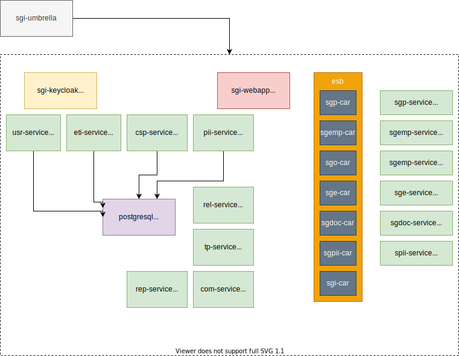

# SGI Helm Charts

This folder includes the deployment charts for the SGI application, that is composed of several micro-services.

The deployment is packaged using [Helm](https://helm.sh/), a tool that is included within the development container of this repository. It is recommended to go through the basic official Helm introduction before following the instructions in this repository.

## Structure



The deployment configuration is divided in two parts:

- [charts](./charts): includes the templated recipes for each micro-service and an umbrella/global chart that deploys the full application (all the required micro-services). Each of the sub-charts includes its own Ingress resource, so they can also be deployed an exposed standalone (given that the other relevant services such as authentication and the database is accessible). Here is a list and a short description of each of the current charts implemented.
  - [charts/sgi-umbrella](./charts/sgi-umbrella): the purpose of this chart is to group all those below to deploy the SGI application in a given environment, to generate a single artifact.
  - [charts/sgi-webapp](./charts/sgi-webapp): this is a chart for the frontend component of the application, it is based on nginx.
  - [charts/sgi-service](./charts/sgi-service): this is a generic chart for each of the SprintBoot micro-services.
  - [charts/sgi-keycloak](./charts/sgi-keycloak): authentication service required by most of the services, currently the configuration is hard-coded in a ConfigMap inside the chart. 
  - [charts/sgi-esb](./charts/sgi-esb): this chart includes an enterprise service bus (ESB) required by SGI, to expose API is required to deploy esb composite applications (CAR). 
    - [charts/sgi-esb-car](./charts/sgi-esb-car): Generic chart for deploying CAR files. These CAR files are deployed with batch jobs (using helm hooks) and copy them into shared persistent volume.
    - [charts/sgi-esb-external](./charts/sgi-esb-external): This is a generic chart for each of the External SprintBoot micro-services to be used by ESB CAR API.
  - For the standard deployment (demo, staging and prod) the umbrella chart also deploys postgresql using the [official bitnami chart](https://github.com/bitnami/charts/tree/master/bitnami/postgresql).
- [config](./config): includes the environment specific configuration to be applied to the umbrella charts. The chart currently will not work without a configuration file (i.e. the values.yaml inside the chart are purposely incomplete). Currently these are the deployment configurations included:
  - [config/values.demo.yaml](./config/values.demo.yaml): configuration for a demo environment.

## Deployment

Eventually the charts artifacts will be constructed and uploaded to a central chart repository. These charts can then be used directly to carry out the deployments together with a given environment configuration. For completion, here are the steps to build the charts locally and carry out a deployment.

The following commands are executed from the directory where this file resides. We will only be building and applying the umbrella chart (that will internally use the other charts described before). Until the chart build and upload to a central repository is completed, they need to be constructed and used locally. Similar steps will be carried out by the CI/CD pipeline. The first step is to update the `sgi-umbrella` chart dependencies:

```bash
# add external repository
helm repo add bitnami https://charts.bitnami.com/bitnami
# update dependencies of umbrella chart
helm dependency update  ./charts/sgi-umbrella/
```

Then we can package the `sgi-umbrella` chart as a ready-to-use artifact as follows:

```bash
helm package  ./charts/sgi-umbrella/
# a file sgi-umbrella-x.x.x.tgz will be created in this directory
```

Alternatively, we can directly install/update or inspect a deployment using directly the folder `./sgi-umbrella` instead of the compressed archive file. Eventually we can also use the name and the version when all the charts are kept at a central repository.

We can then upgrade (or install if it does not exist), for example the demo environment, using the following command:

```bash
helm upgrade sgi sgi-umbrella-0.1.29.tgz --install --namespace sgi-demo -f ./config/values.demo.yaml
```

To modify some of the properties of the environment we can either modify the corresponding `values.*.yaml` file or directly overwrite a given parameter using `--set`.  For example imagine we want to overwrite the usr-service version in `values.demo.yaml` with a newer docker image version `0.1.0`, we can use the following command:

```bash
helm upgrade sgi sgi-umbrella-0.1.29.tgz --install --namespace sgi-demo -f ./config/values.demo.yaml --set usr-service.image.tag==0.1.0
```

The previous pattern can be very useful for updating an environment within the CI/CD pipeline of a given service. Note that to use the command as before, we need to have access the the `values.demo.yaml` with the default values. Alternatively if we are simply upgrading an environment (e.g. changing the image tag of one of the services) we can simply use the option `--reuse-values` instead of specifying the default environment values.
